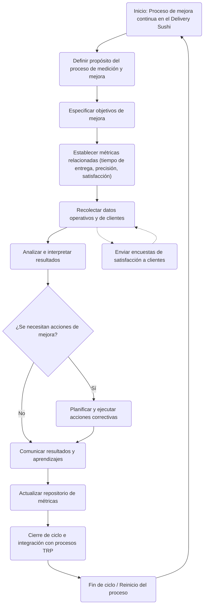

# Sushi

```mermaid
flowchart TD
    A("Inicio: Proceso de mejora continua en el Delivery Sushi")
    B("Definir propósito del proceso de medición y mejora")
    C("Especificar objetivos de mejora")
    D("Establecer métricas relacionadas (tiempo de entrega, precisión, satisfacción)")
    E("Recolectar datos operativos y de clientes")
    F("Analizar e interpretar resultados")
    G{"¿Se necesitan acciones de mejora?"}
    H("Planificar y ejecutar acciones correctivas")
    I("Comunicar resultados y aprendizajes")
    J("Actualizar repositorio de métricas")
    K("Cierre de ciclo e integración con procesos TRP")
    L("Fin de ciclo / Reinicio del proceso")

    A --> B
    B --> C
    C --> D
    D --> E
    E --> F
    F --> G
    G -- Sí --> H
    G -- No --> I
    H --> I
    I --> J
    J --> K
    K --> L
    L --> A

    %% Flujos externos (cliente)
    E -.-> M("Enviar encuestas de satisfacción a clientes")
    M -.-> E
```
