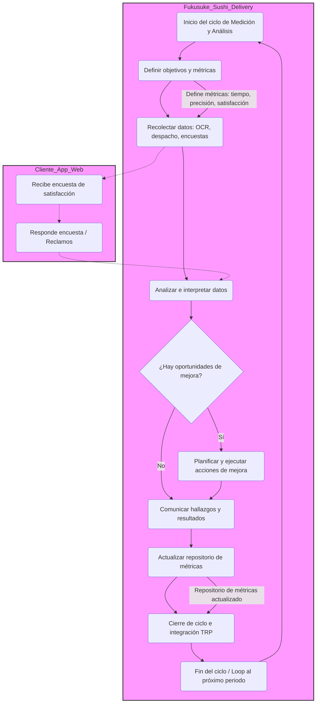

# Sushi

```mermaid
flowchart TD
  subgraph Fukusuke_Sushi_Delivery
    direction TB
    Gerencia_Inicio("Inicio del ciclo de Medición y Análisis")
    Definir_Obj("Definir objetivos y métricas")
    Recolectar_Datos("Recolectar datos: OCR, despacho, encuestas")
    Analizar_Datos("Analizar e interpretar datos")
    Decidir_Mejora{"¿Hay oportunidades de mejora?"}
    Accion_Mejora("Planificar y ejecutar acciones de mejora")
    Comunicar("Comunicar hallazgos y resultados")
    Actualizar_Repo("Actualizar repositorio de métricas")
    Cierre_Ciclo("Cierre de ciclo e integración TRP")
    Fin_Ciclo("Fin del ciclo / Loop al próximo periodo")

    Gerencia_Inicio --> Definir_Obj
    Definir_Obj --> Recolectar_Datos
    Recolectar_Datos --> Analizar_Datos
    Analizar_Datos --> Decidir_Mejora
    Decidir_Mejora -- Sí --> Accion_Mejora
    Decidir_Mejora -- No --> Comunicar
    Accion_Mejora --> Comunicar
    Comunicar --> Actualizar_Repo
    Actualizar_Repo --> Cierre_Ciclo
    Cierre_Ciclo --> Fin_Ciclo
    Fin_Ciclo --> Gerencia_Inicio
  end

  subgraph Cliente_App_Web
    direction TB
    Recibe_Encuesta("Recibe encuesta de satisfacción")
    Responde_Encuesta("Responde encuesta / Reclamos")
  end

  Recolectar_Datos -.-> Recibe_Encuesta
  Recibe_Encuesta -.-> Responde_Encuesta
  Responde_Encuesta -.-> Analizar_Datos

  %% Artefactos y almacenes pueden representarse con anotaciones
  Definir_Obj -- "Define métricas: tiempo, precisión, satisfacción" --> Recolectar_Datos
  Actualizar_Repo -- "Repositorio de métricas actualizado" --> Cierre_Ciclo

  %% Notas explicativas
  classDef pool fill:#f9f,stroke:#333,stroke-width:2px;
  class Fukusuke_Sushi_Delivery pool;
  class Cliente_App_Web pool;
```
