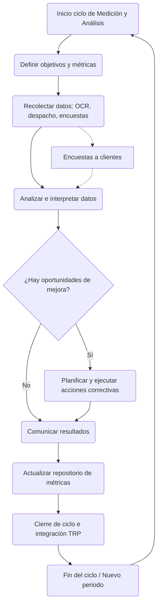

# Sushi

```mermaid
flowchart TD
    A(Inicio ciclo de Medición y Análisis)
    B(Definir objetivos y métricas)
    C(Recolectar datos: OCR, despacho, encuestas)
    D(Analizar e interpretar datos)
    E{¿Hay oportunidades de mejora?}
    F(Planificar y ejecutar acciones correctivas)
    G(Comunicar resultados)
    H(Actualizar repositorio de métricas)
    I(Cierre de ciclo e integración TRP)
    J(Fin del ciclo / Nuevo periodo)

    A --> B
    B --> C
    C --> D
    D --> E
    E -- Sí --> F
    E -- No --> G
    F --> G
    G --> H
    H --> I
    I --> J
    J --> A

    %% Flujos externos (cliente)
    C -.-> K[Encuestas a clientes]
    K -.-> D
```
