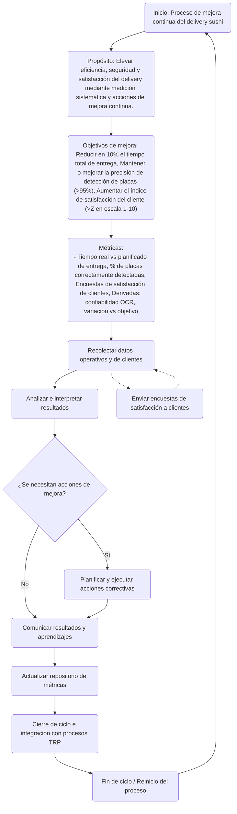

# Sushi

```mermaid
flowchart TD
    A("Inicio: Proceso de mejora continua del delivery sushi")
    B("Propósito: Elevar eficiencia, seguridad y satisfacción del delivery mediante medición sistemática y acciones de mejora continua.")
    C("Objetivos de mejora: Reducir en 10% el tiempo total de entrega, Mantener o mejorar la precisión de detección de placas (>95%), Aumentar el índice de satisfacción del cliente (>Z en escala 1-10)")
    D("Métricas:\n- Tiempo real vs planificado de entrega, % de placas correctamente detectadas, Encuestas de satisfacción de clientes, Derivadas: confiabilidad OCR, variación vs objetivo")
    E("Recolectar datos operativos y de clientes")
    F("Analizar e interpretar resultados")
    G{"¿Se necesitan acciones de mejora?"}
    H("Planificar y ejecutar acciones correctivas")
    I("Comunicar resultados y aprendizajes")
    J("Actualizar repositorio de métricas")
    K("Cierre de ciclo e integración con procesos TRP")
    L("Fin de ciclo / Reinicio del proceso")

    A --> B
    B --> C
    C --> D
    D --> E
    E --> F
    F --> G
    G -- Sí --> H
    G -- No --> I
    H --> I
    I --> J
    J --> K
    K --> L
    L --> A

    %% Flujo externo (cliente)
    E -.-> M("Enviar encuestas de satisfacción a clientes")
    M -.-> E
```
