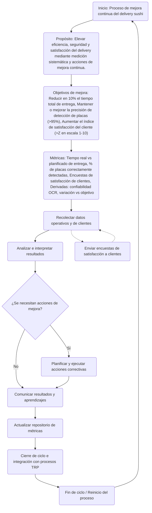
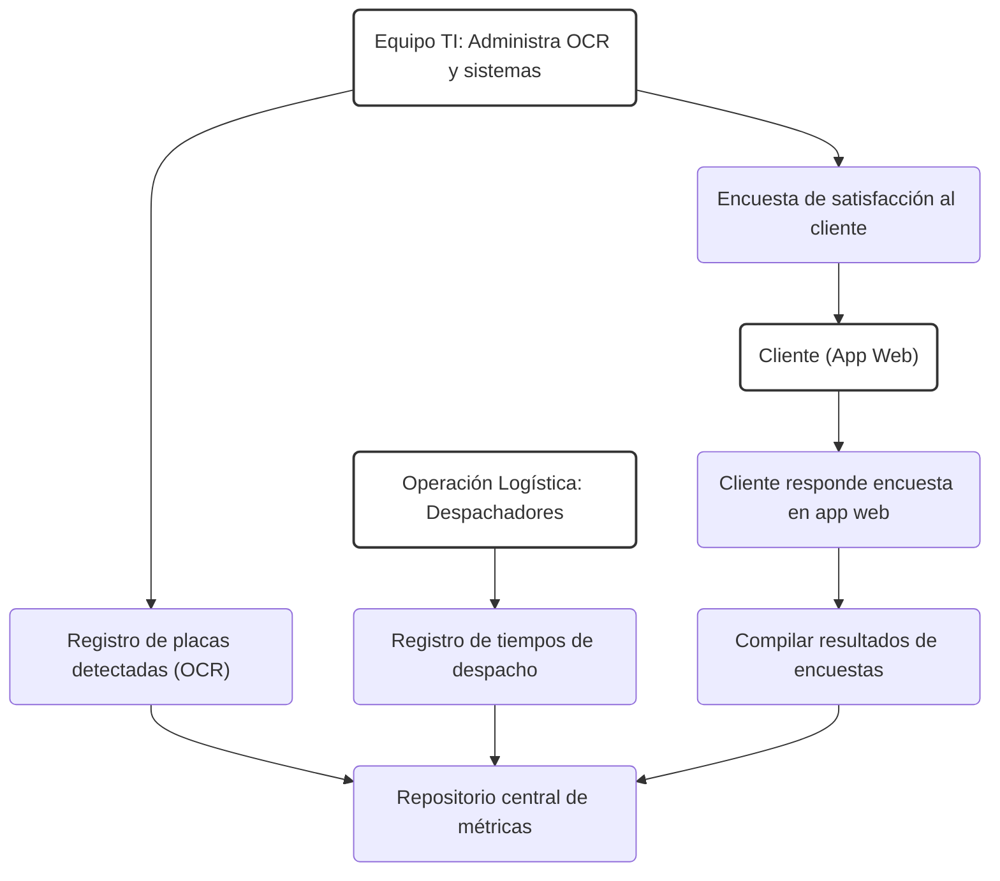
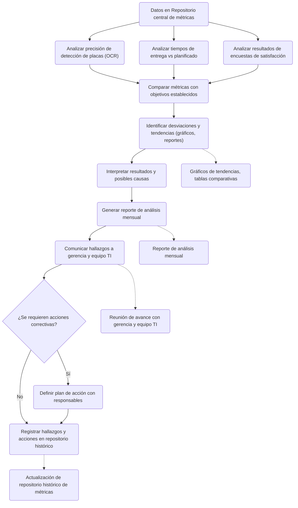

# Avengers: Mejora del Sushi

# Diagrama 1

```mermaid
flowchart TD
    A("Inicio: Proceso de mejora continua del delivery sushi")
    B("Propósito: Elevar eficiencia, seguridad y satisfacción del delivery mediante medición sistemática y acciones de mejora continua.")
    C("Objetivos de mejora: Reducir en 10% el tiempo total de entrega, Mantener o mejorar la precisión de detección de placas (>95%), Aumentar el índice de satisfacción del cliente (>Z en escala 1-10)")
    D("Métricas: Tiempo real vs planificado de entrega, % de placas correctamente detectadas, Encuestas de satisfacción de clientes, Derivadas: confiabilidad OCR, variación vs objetivo")
    E("Recolectar datos operativos y de clientes")
    F("Analizar e interpretar resultados")
    G{"¿Se necesitan acciones de mejora?"}
    H("Planificar y ejecutar acciones correctivas")
    I("Comunicar resultados y aprendizajes")
    J("Actualizar repositorio de métricas")
    K("Cierre de ciclo e integración con procesos TRP")
    L("Fin de ciclo / Reinicio del proceso")

    A --> B
    B --> C
    C --> D
    D --> E
    E --> F
    F --> G
    G -- Sí --> H
    G -- No --> I
    H --> I
    I --> J
    J --> K
    K --> L
    L --> A

    %% Flujo externo (cliente)
    E -.-> M("Enviar encuestas de satisfacción a clientes")
    M -.-> E
```

# Diagrama 2

```mermaid
flowchart TD
    %% Roles
    TI("Equipo TI: Administra OCR y sistemas")
    Logistica("Operación Logística: Despachadores")
    Cliente("Cliente (App Web)")

    %% Fuentes de datos
    A("Registro de placas detectadas (OCR)")
    B("Registro de tiempos de despacho")
    C("Encuesta de satisfacción al cliente")
    D("Cliente responde encuesta en app web")
    E("Compilar resultados de encuestas")
    F("Almacenar datos en repositorio central de métricas")

    %% Flujo interno
    TI --> A
    Logistica --> B
    TI --> C
    C --> Cliente
    Cliente --> D
    D --> E
    A --> F
    B --> F
    E --> F

    %% Opcional: Repositorio
    F("Repositorio central de métricas")

    %% Notas y artefactos
    classDef role fill:#fff,stroke:#333,stroke-width:2px;
    class TI,Logistica,Cliente role;
```

# Diagrama 3

```mermaid
flowchart TD
    %% Inicio: Datos en repositorio
    A("Datos en Repositorio central de métricas")

    %% Análisis de métricas
    B("Analizar precisión de detección de placas (OCR)")
    C("Analizar tiempos de entrega vs planificado")
    D("Analizar resultados de encuestas de satisfacción")
    E("Comparar métricas con objetivos establecidos")
    F("Identificar desviaciones y tendencias (gráficos, reportes)")

    %% Interpretación y comunicación
    G("Interpretar resultados y posibles causas")
    H("Generar reporte de análisis mensual")
    I("Comunicar hallazgos a gerencia y equipo TI")

    %% Decisión y acciones posteriores
    J{"¿Se requieren acciones correctivas?"}
    K("Definir plan de acción con responsables")
    L("Registrar hallazgos y acciones en repositorio histórico")

    %% Flujo principal
    A --> B
    A --> C
    A --> D
    B --> E
    C --> E
    D --> E
    E --> F
    F --> G
    G --> H
    H --> I
    I --> J
    J -- Sí --> K
    J -- No --> L
    K --> L

    %% Artefactos y eventos
    H -.-> M("Reporte de análisis mensual")
    F -.-> N("Gráficos de tendencias, tablas comparativas")
    L -.-> O("Actualización de repositorio histórico de métricas")

    %% Reunión de seguimiento
    I -.-> P("Reunión de avance con gerencia y equipo TI")
```
